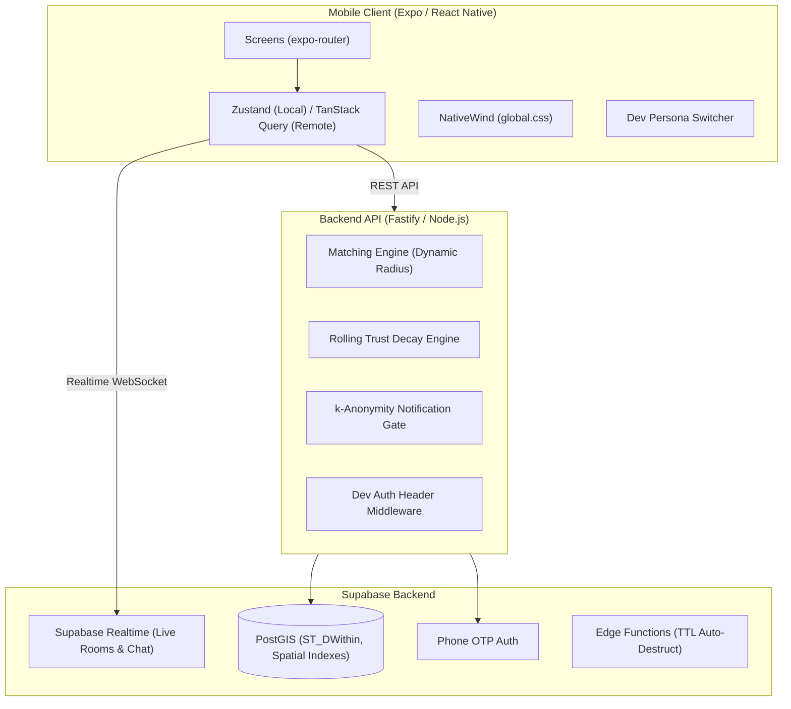

# System Architecture Document

## Overview
Hobbie is a real-time, activity-anchored matching engine built for dense urban hubs (tech parks, gated communities).

## Key Architectural Directives
1. **Independent Deployability:** `apps/mobile` and `apps/server` have zero cross-runtime dependencies. Shared contracts live in `packages/shared`.
2. **Ephemerality & TTL Lifecycle:** All room chats and pins auto-expire after TTL (2-4 hrs).
3. **Privacy First:** Unaccepted participants see fuzzed coordinates (~100m). Exact venue is revealed only upon join acceptance.
